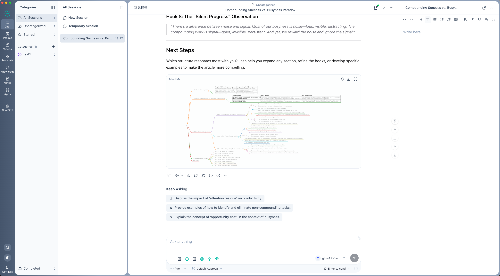

<div align="center">
  

  <h1>Mirdel</h1>

  <p>
    <strong>Next-generation AI workspace</strong><br/>
    A local-first desktop AI workspace for conversations, knowledge, notes, translation, images/videos, local models, and extensible workflows.
  </p>

  <p>
    <a href="https://github.com/mirdel/mirdel/blob/main/LICENSE"></a>
    <a href="https://github.com/mirdel/mirdel/releases/latest"></a>
    <a href="https://github.com/mirdel/mirdel/releases"></a>
    <a href="https://github.com/mirdel/mirdel/stargazers"></a>
    
    
    
  </p>

  <p>
    <a href="./README.md">English</a> ·
    <a href="./README.zh-CN.md">简体中文</a>
  </p>

  <p>
    <a href="https://www.mirdel.ai">Website</a> ·
    <a href="https://github.com/mirdel/mirdel/releases">Downloads</a> ·
    <a href="https://github.com/mirdel/mirdel/issues">Feedback</a>
  </p>
</div>

<br/>



## What Is Mirdel?

Mirdel is an open-source, local-first AI workspace for the desktop. It brings conversations, knowledge bases, notes, translation, images/videos, local models, and extensible workflows into one long-lived native app, so AI becomes a personal workspace you can organize, preserve, and reuse instead of a series of one-off chats.

Mirdel's core idea is simple: keep data local where possible, let users choose their models, and turn repeated workflows into reusable capabilities. You can use it as a stronger AI client, or as a long-term desktop AI workspace.

## Why Mirdel?

- **Local-first**: conversations, notes, knowledge bases, settings, and indexes live in local SQLite databases; sensitive fields such as API keys are encrypted at rest.
- **Unified model management**: use mainstream cloud providers, OpenAI/Anthropic/Google-compatible custom endpoints, and bundled local model runtime from one place.
- **Built for long-term use**: projects, categories, stars, completion state, global search, layered memory, session notes, and knowledge bases keep AI history useful.
- **Smooth at scale**: virtualized lists, streaming Markdown rendering, and shallow reactivity keep thousands of sessions and tens of thousands of messages responsive.
- **Applets**: turn high-frequency AI workflows into Applets with UI, parameters, and interaction state, so complex tasks can move from "write the prompt again" to "open and run".
- **Truly extensible**: Skills add procedural knowledge, MCP connects tools such as filesystem and shell, and Applets productize complex workflows.
- **Batteries included, not locked in**: bundled free web search, local `llama-server`, document parsing, TTS, and an AI SDK DevTools launcher, with room for advanced configuration.

## Features

### Conversations And Session Management

- **Branch conversations**: fork any turn into parallel paths for comparing models, prompts, or reasoning directions.
- **Session Map**: visualize messages, branches, and context relationships as an interactive graph.
- **Temporary sessions**: ask one-off questions without adding them to your session list.
- **Quick Ask**: use a floating quick-reply surface that can optionally read the current session context without triggering tools or polluting chat history.
- **Session notes**: attach a note surface to each session and append AI replies with one click.
- **Projects and categories**: organize sessions with custom categories plus built-in All, Uncategorized, Starred, and Completed views.
- **Scenarios**: package model, parameters, system prompt, default knowledge bases, Skill policy, and MCP policy into reusable presets.
- **Prompt library**: maintain searchable, tagged, favoritable prompts with variable placeholders.
- **Memory system**: use current context, session-state memory, cross-session memory, historical memory through local RAG, and long-term user preferences.
- **Rich message blocks**: Markdown, syntax-highlighted code, LaTeX, Mermaid, mind maps, timed thinking blocks, tool-call blocks, and source cards.

### Models: Cloud, Local, And Compatible Endpoints

- **Mainstream providers**: OpenAI, Anthropic, Google, xAI, Alibaba DashScope/Qwen, ByteDance Doubao, DeepSeek, Zhipu, Minimax, and more.
- **Compatible endpoints**: connect any OpenAI-compatible, Anthropic-compatible, or Google-compatible custom endpoint.
- **Bundled local model runtime**: use the embedded `llama-server` to download, load, unload, and run local models with automatic memory guidance.
- **Local OpenAI-compatible service**: expose local models through an OpenAI-compatible HTTP endpoint with an auto-generated API key for other apps on the same machine.
- **Capability-aware model configuration**: input/output modalities, vision, function calling, reasoning, streaming, image tasks, size/aspect-ratio settings, custom parameter schemas, and thinking presets.
- **Native search injection**: choose among `providerOptions`, `tools`, `sdkTools`, and `sdkNative` modes to fit provider protocols.

### Web Search

- **Bundled SearXNG**: ships with an embedded Python runtime and SearXNG, aggregating multiple mainstream search engines.
- **Custom search services**: visually configure request URL, method, headers, query field, response path, and content field.
- **Result processing**: choose RAG or truncation, with configurable concurrent fetching, per-page timeout, and chunking.

### Knowledge Base And Local RAG

- **Multiple sources**: text, files, recursive directories, and web URLs.
- **Built-in parsers**: `.docx`, `.pdf`, `.pptx`, `.xlsx`, Markdown, and code files.
- **Local vector index**: SQLite + `sqlite-vec`, with knowledge data and indexes managed locally.
- **Configurable embeddings**: choose embedding model and dimension, with guided migration when they change.
- **Incremental sync**: detect item-level changes and refresh only what changed.
- **Recall testing**: built-in panel for checking whether retrieval hits the expected content.

### Notes

- **Dual-mode editor**: Tiptap visual editing and Markdown source editing.
- **AI assistant per note**: each note has its own assistant history for writing, rewriting, and organizing.
- **Diff-style edit proposals**: AI edits are proposed as diffs and only applied after you accept them.
- **Organization and traceability**: lists, groups, linked-session navigation, word count, and timestamps.

### Translation

- **Text translation**: for short text, snippets, and quick translation.
- **Whole-document translation**: supports docx, pdf, pptx, xlsx, txt, and md.
- **Dictionary-style breakdowns**: pronunciation, part of speech, meanings, synonyms/antonyms, phrases, examples, etymology, and notes.
- **Dedicated translation model**: use a separate model for faster or lower-cost translation.

### Image Workspace

- **Unified image UI**: DashScope, Doubao, Minimax, Zhipu, and AI SDK image providers.
- **Multiple image tasks**: text-to-image, image-to-image, image editing, inpaint, outpaint, super-resolution, colorization, stylization, and watermark removal.
- **Reproducible parameters**: size, aspect ratio, negative prompt, prompt expansion, seed, and model-level custom parameter schemas.
- **Result reuse**: reuse parameters, use a result as edit input, or generate again with one click.

### Video Workspace

- **Video providers**: Zhipu and AI SDK video providers.
- **Generation parameters**: resolution, duration, FPS, seed, reference images, negative prompt, and provider options.
- **Model-level toggles**: prompt expansion, single/multi shot, audio generation, fixed camera, service tier, draft mode, quality mode, and person-generation policy.

### Applets: Programmable Workflows With UI And Interaction

Applets are one of Mirdel's core extension primitives. Think of them as Skills with UI and interaction: Skills are better for giving the agent procedural knowledge and operating instructions, while Applets turn stable AI workflows into reusable interactive apps. An Applet can have its own forms, parameters, interaction state, result display, and standalone window, turning complex flows from "write the prompt every time" into "open and use".

- **Productized workflows**: package repeated AI flows into clickable, configurable, reusable Applets for personal or team workflows.
- **UI and interaction built in**: describe inputs, parameters, and output structure with a schema-based UI DSL.
- **Isolated runtime**: each Applet runs in an isolated subprocess managed by Mirdel.
- **In-app development**: author and adjust Applets directly in Mirdel with a Monaco file-tree editor, auto-save, and binary-safe reads.
- **Playground and examples**: validate ideas quickly and iterate on workflows.

### Skills: Procedural Knowledge For The Agent

- **Claude Agent Skills compatible**: `SKILL.md` + frontmatter + scripts / references / assets.
- **Built-in system skills**: `docx`, `pdf`, `pptx`, `xlsx`, `skill-creator`, and more.
- **Create skills through chat**: use `skill-creator` to turn new workflows into Skills.
- **Per-message policy**: set Skill behavior to `auto`, `manual`, or `off` for each message.

### MCP Client

- **Three transports**: stdio, Streamable HTTP, and SSE.
- **Built-in servers**: `filesystem` and `shell`, always available.
- **Visual management**: enable/disable servers, inspect Tools / Prompts / Resources, view runtime logs, and manage Use Cases.
- **Per-message policy**: set MCP behavior to `auto`, `manual`, or `off` for each message.

### Safety, Privacy, And System Features

- **Tool-call approval**: shell commands and MCP tools use allowlists; sensitive calls require human approval and support explicit rejection.
- **Local data import/export**: export or import all app data as a ZIP archive, with automatic safety backups before import.
- **Encrypted sensitive fields**: API keys and other sensitive settings are encrypted at rest.
- **Languages**: English, Simplified Chinese, and Traditional Chinese, with follow-system as the default.
- **Themes**: follow system, dark, and light.

## Download

- Latest release: [github.com/mirdel/mirdel/releases/latest](https://github.com/mirdel/mirdel/releases/latest)
- All releases: [github.com/mirdel/mirdel/releases](https://github.com/mirdel/mirdel/releases)

| Platform | Architecture | Installer |
| --- | --- | --- |
| macOS | Apple Silicon | `Mirdel-<version>-mac-arm64.dmg` |
| macOS | Intel | `Mirdel-<version>-mac-x64.dmg` |
| Windows | x64 | `Mirdel-<version>-win-x64.exe` |

## First Run

1. Download and install the build that matches your platform and architecture.
2. Launch Mirdel and choose language and theme.
3. Configure at least one model in Settings - Model Service: paste a cloud provider API key, or download and run a local model.
4. Start a conversation. If you want AI to answer based on your own materials, create a knowledge base and import files, folders, or web pages.
5. For repeated workflows, configure Scenarios, the prompt library, Skills, MCP, or Applets.

## Developer Guide

### Tech Stack

- **Desktop**: Electron + electron-vite
- **Frontend**: Vue 3, Pinia, Vue Router, Vue I18n, Tailwind CSS, @nuxt/ui
- **AI**: AI SDK, multi-provider model layer, MCP, Skills, local `llama-server`
- **Data**: SQLite, FTS5, `sqlite-vec`, local files and runtime resources
- **Editing and rendering**: Tiptap, Monaco, Mermaid, markmap, KaTeX, Shiki / highlight.js
- **Tooling**: pnpm workspace, Vitest, GitHub Actions, electron-builder

### Monorepo Layout

```text
.
├── packages/
│   ├── desktop/             # Electron desktop app
│   ├── applet-core/         # Typed Applet runtime
│   ├── shared/              # Shared code
│   ├── markdown-to-plain/   # Markdown to plain-text utility
│   └── tts-edge/            # Edge TTS support
├── scripts/                 # Repository-level scripts
├── .github/workflows/       # Test and release workflows
├── RELEASE.md               # Release process
├── TESTING.md               # Testing notes
└── AGENTS.md                # Project collaboration and coding conventions
```

### Requirements

- **Node.js** `>=24 <25` (see [`.nvmrc`](./.nvmrc))
- **pnpm** `9.15.0` (declared in `package.json` / `packageManager`)
- macOS 13+ or Windows 10/11 for building desktop installers

### Local Development

```bash
git clone https://github.com/mirdel/mirdel.git
cd mirdel

pnpm install
pnpm dev
```

`pnpm dev` runs `@mirdel/desktop` in Electron + Vite development mode.

### Useful Commands

Development and build:

```bash
pnpm dev                  # Start desktop development mode
pnpm build                # Build renderer + main bundles
pnpm preview              # Preview the built app without packaging
pnpm applet:playground    # Start the Applet development playground
```

Testing:

```bash
pnpm test                 # Run tests for all packages
pnpm test:desktop         # Run all @mirdel/desktop tests
pnpm test:desktop:data    # Data-layer tests
pnpm test:desktop:store   # Pinia store tests
pnpm test:desktop:service # Main-process service tests
pnpm test:desktop:router  # IPC router tests
```

Release builds:

```bash
pnpm release:local        # Package a local macOS arm64 dmg for validation
pnpm release              # Run a full desktop build for the current platform
```

See [TESTING.md](./TESTING.md) for testing notes and [RELEASE.md](./RELEASE.md) for the release process.

### CI And Release

- `Desktop Tests` runs on relevant pull requests and main-branch pushes, including Windows-compatible path checks and desktop core tests.
- `Desktop Release Matrix` runs manually or when pushing a `v*` tag, building macOS arm64, macOS x64, and Windows x64 artifacts.
- The tag version must match the desktop app version in `packages/desktop/package.json`.

## Contributing

Issues, pull requests, ideas, and bug reports are welcome.

- Bugs and feature requests: [github.com/mirdel/mirdel/issues](https://github.com/mirdel/mirdel/issues)
- Before opening a pull request, please run `pnpm lint` and the relevant test commands.

## License

Mirdel is released under the [MIT License](./LICENSE).

Third-party components and their licenses are tracked in [packages/desktop/THIRD_PARTY_NOTICES.md](./packages/desktop/THIRD_PARTY_NOTICES.md).

---

<div align="center">
  <sub>© Mirdel Team · Released under the MIT License</sub>
</div>
