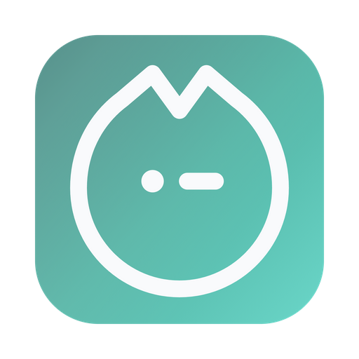
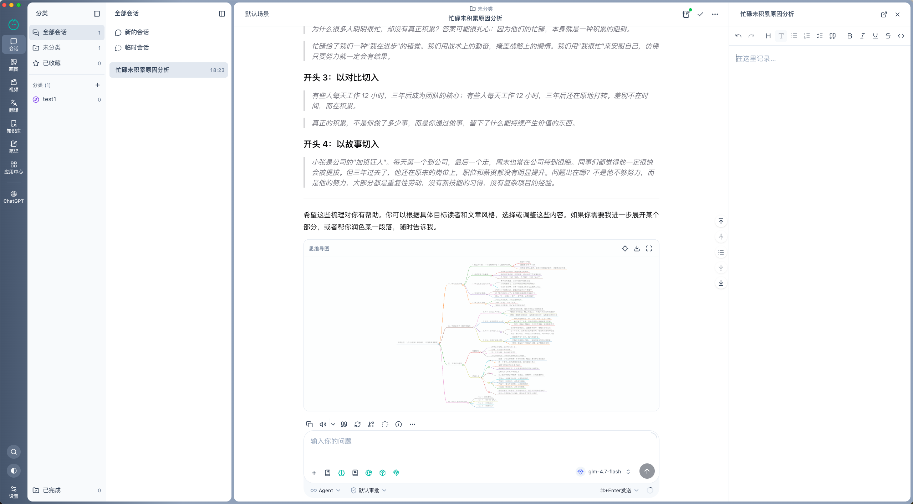

<div align="center">
  

  <h1>Mirdel</h1>

  <p>
    <strong>下一代 AI 工作台</strong><br/>
    面向桌面的本地优先 AI 工作台，统一对话、知识库、笔记、翻译、图像/视频、本地模型与可扩展工作流。
  </p>

  <p>
    <a href="https://github.com/mirdel/mirdel/blob/main/LICENSE"></a>
    <a href="https://github.com/mirdel/mirdel/releases/latest"></a>
    <a href="https://github.com/mirdel/mirdel/releases"></a>
    <a href="https://github.com/mirdel/mirdel/stargazers"></a>
    
    
    
  </p>

  <p>
    <a href="./README.md">English</a> ·
    <a href="./README.zh-CN.md">简体中文</a>
  </p>

  <p>
    <a href="https://www.mirdel.ai">官网</a> ·
    <a href="https://github.com/mirdel/mirdel/releases">下载</a> ·
    <a href="https://github.com/mirdel/mirdel/issues">反馈</a>
  </p>
</div>

<br/>



## Mirdel 是什么？

Mirdel 是一款开源、本地优先的桌面 AI 工作台。它把对话、知识库、笔记、翻译、图像/视频、本地模型和可扩展工作流放进一个长期可用的原生桌面应用中，让 AI 不只是一次性问答，而是可以持续沉淀、组织和复用的个人工作区。

Mirdel 的核心理念是：数据尽量留在本地，模型选择交给用户，重复工作流可以被沉淀为可复用能力。你可以把它当作一个更强的 AI 客户端，也可以把它作为自己的桌面 AI 工作区长期使用。

## 为什么选择 Mirdel？

- **本地优先**：会话、笔记、知识库、配置和索引存储在本地 SQLite 数据库中，API Key 等敏感字段加密保存。
- **多模型统一管理**：同时支持主流云端模型、兼容 OpenAI/Anthropic/Google 协议的自定义端点，以及内置本地模型运行时。
- **为长期使用设计**：项目、分类、收藏、完成状态、全局搜索、分层记忆、会话笔记和知识库让 AI 历史不再只是一次性记录。
- **海量数据也不卡**：虚拟滚动、流式 Markdown、大对象浅响应让上千会话、上万消息依然保持顺滑。
- **独创 Applets 轻应用**：把高频 AI 工作流做成带 UI、参数和交互状态的小应用，让复杂任务从“每次写提示词”变成“打开即可使用”。
- **真正可扩展**：Skills 注入领域过程知识，MCP 连接文件系统、Shell 以及更多外部工具，Applets 则负责把复杂流程产品化。
- **开箱即用但不封闭**：内置 10+ 免费网络搜索、本地 `llama-server`、文档解析、TTS、AI SDK DevTools 启动入口，同时保留高级配置空间。

## 功能特色

### 对话与会话管理

- **分支对话**：任何一轮消息都可以分叉出并行路径，适合比较不同模型、提示词或推理方向。
- **会话地图**：把消息、分支和上下文关系可视化成交互式节点图，复杂探索过程不再迷路。
- **临时会话**：用于一次性提问，不进入会话列表，适合不需要长期保存的内容。
- **快捷消息**：浮层式快问快答，可选读取当前会话作为上下文，不触发工具调用，不会污染会话历史。
- **会话笔记**：每个会话都可以绑定笔记面板，一键把 AI 回复追加到笔记中，方便整理结论。
- **项目与分类**：支持自定义分类，并提供全部、未分类、收藏、已完成等内置视图。
- **场景模板**：把模型、参数、系统提示词、默认知识库、Skill 策略、MCP 策略打包成可复用预设。
- **提示词库**：支持搜索、标签、收藏和变量占位符，常用提示词可以长期维护。
- **记忆系统**：支持当前上下文、会话状态记忆、跨会话记忆、历史会话记忆（本地 RAG）与长期用户偏好。
- **富消息块**：支持 Markdown、代码高亮、LaTeX、Mermaid、思维导图（markmap）、带计时的思考块、工具调用块和来源卡片。

### 模型：云端、本地与兼容端点

- **主流模型厂商**：支持 OpenAI、Anthropic、Google、xAI、阿里云（DashScope / 通义）、字节跳动（豆包）、DeepSeek、智谱、Minimax 等。
- **兼容协议接入**：支持任意 OpenAI 兼容、Anthropic 兼容、Google 兼容的自定义端点。
- **内置本地模型运行时**：通过嵌入式 `llama-server` 下载、加载、卸载本地模型，并自动处理内存需求。
- **本地 OpenAI 兼容服务**：本地模型服务以 OpenAI 兼容 HTTP 接口暴露，并自动生成 API Key，本机其他应用也可以调用。
- **模型能力配置**：支持输入/输出模态、视觉、Function Calling、推理、流式、图像任务、尺寸/比例、自定义参数 Schema、思考预设等能力描述。
- **Native Search 注入模式**：提供 `providerOptions`、`tools`、`sdkTools`、`sdkNative` 四种模式，适配不同厂商协议。

### 联网搜索

- **内置 SearXNG**：随应用提供嵌入式 Python 运行时和 SearXNG，聚合多个主流搜索引擎。
- **自定义搜索服务**：可视化配置请求 URL、方法、Header、查询字段、响应路径和内容字段。
- **结果处理策略**：支持 RAG 或截断两种处理方式，可配置并发抓取、单页超时和结果切块。

### 知识库与本地 RAG

- **多来源导入**：支持纯文本、文件、目录（递归）和网页 URL。
- **内置文档解析**：支持 `.docx`、`.pdf`、`.pptx`、`.xlsx`、Markdown 和代码文件。
- **本地向量索引**：基于 SQLite + `sqlite-vec`，知识数据与索引都在本地管理。
- **Embedding 可配置**：可选择嵌入模型和维度，切换时提供迁移引导。
- **增量同步**：按条目检测变更并刷新，避免每次都全量重建。
- **召回测试**：内置召回测试面板，方便检查知识库是否真正命中预期内容。

### 笔记

- **双模式编辑器**：支持 Tiptap 可视化编辑和 Markdown 源码编辑。
- **笔记 AI 助手**：每条笔记拥有独立助手历史，可用于写作、改写和整理。
- **差异式编辑提案**：AI 修改不会直接覆盖正文，而是以 diff 形式提交，由你确认后落库。
- **组织与回溯**：支持列表、分组、关联会话跳转、字数统计和时间戳。

### 翻译

- **文本翻译**：适合短文本、片段和即时翻译。
- **整篇文档翻译**：支持 docx、pdf、pptx、xlsx、txt、md 等格式。
- **词典式解析**：提供发音、词性、释义、同义/反义、常用短语、例句、词源和备注。
- **独立翻译模型**：翻译可以使用单独模型，方便选择更快或更低成本的配置。

### 图像工作台

- **统一图像生成界面**：覆盖 DashScope、豆包、Minimax、智谱以及 AI SDK 图像 Provider。
- **多种图像任务**：支持文生图、图生图、图像编辑、Inpaint（遮罩）、Outpaint（扩图）、超分、上色、风格化和去水印。
- **可复现参数**：支持尺寸、比例、负向提示词、Prompt 扩写、Seed 复现，以及模型级自定义参数 Schema。
- **结果复用**：可一键复用参数、将结果作为编辑输入、再次生成。

### 视频工作台

- **视频 Provider**：支持智谱和 AI SDK video 提供方。
- **生成参数**：支持分辨率、时长、帧率、Seed、参考图、负向提示词和 provider options。
- **模型级能力开关**：支持 Prompt 扩写、单镜/多镜、生成音频、相机固定、Service Tier、Draft 模式、Quality 模式和人物生成策略。

### Applets 轻应用：带 UI 和交互的可编程工作流

Applets 是 Mirdel 的核心扩展能力之一。你可以把它理解为“带 UI 和交互的 Skill”：Skill 更适合为智能体补充领域知识和操作步骤，Applet 则适合把已经稳定下来的 AI 工作流做成一个真正可使用的小应用。它可以有自己的表单、参数、交互状态、结果展示和独立窗口，让复杂流程从“每次都写提示词”变成“打开即可使用”。

- **工作流产品化**：把固定的 AI 流程封装成可点击、可配置、可复用的轻应用，适合沉淀团队或个人的高频任务。
- **自带界面与交互**：基于 Schema 的 UI DSL 描述输入控件、参数和展示结构，不只是运行脚本，也能承载完整交互。
- **隔离运行**：每个 Applet 在独立子进程中执行，并由进程管理器托管，避免一个工作流影响整个桌面应用。
- **应用内开发体验**：内置 Monaco 文件树编辑器，支持自动保存和二进制安全读取，可以直接在 Mirdel 内编写和调整 Applet。
- **Playground 与示例**：内置 Playground 和示例 Applet，方便快速验证想法并迭代工作流。

### Skills：为智能体注入过程性知识

- **兼容 Claude Agent Skills 格式**：使用 `SKILL.md` + frontmatter + scripts / references / assets 组织技能。
- **内置技能**：提供 `docx`、`pdf`、`pptx`、`xlsx`、`skill-creator` 等系统技能。
- **通过对话创建技能**：可借助 `skill-creator` 把新的工作流程沉淀为 Skill。
- **按消息控制策略**：每条消息可设置 Skill 策略为 `auto` / `manual` / `off`。

### MCP 客户端

- **三种传输方式**：支持 stdio、Streamable HTTP、SSE。
- **内置服务器**：提供 `filesystem` 和 `shell`，始终可用。
- **可视化管理**：支持服务启停、能力查看（Tools / Prompts / Resources）、运行日志和 Use Cases。
- **按消息控制策略**：每条消息可设置 MCP 策略为 `auto` / `manual` / `off`。

### 安全、隐私与系统能力

- **工具调用审批**：Shell 命令和 MCP 工具具备 allowlist，敏感调用需要人工确认，并支持明确拒绝。
- **本地数据导入导出**：一键将应用数据导出/导入为 ZIP，导入前自动创建安全备份。
- **敏感字段加密**：API Key 等敏感配置加密存储。
- **多语言**：支持 English、简体中文、繁體中文，默认跟随系统语言。
- **主题**：支持跟随系统、深色和浅色模式。

## 下载

- 最新版本：[github.com/mirdel/mirdel/releases/latest](https://github.com/mirdel/mirdel/releases/latest)
- 全部版本：[github.com/mirdel/mirdel/releases](https://github.com/mirdel/mirdel/releases)


| 平台      | 架构            | 安装包                              |
| ------- | ------------- | -------------------------------- |
| macOS   | Apple Silicon | `Mirdel-<version>-mac-arm64.dmg` |
| macOS   | Intel         | `Mirdel-<version>-mac-x64.dmg`   |
| Windows | x64           | `Mirdel-<version>-win-x64.exe`   |


## 首次使用

1. 下载并安装与你的系统和架构匹配的版本。
2. 启动 Mirdel，选择语言和主题。
3. 在设置-模型服务中配置至少一个模型：可以填写云厂商 API Key，也可以下载并运行本地模型。
4. 开始对话；如需让 AI 基于你的资料回答，可先创建知识库并导入文件、目录或网页。
5. 如果你有固定工作流，可以继续配置场景、提示词库、Skills、MCP 或 Applets。

## 开发者指南

### 技术栈

- **桌面框架**：Electron + electron-vite
- **前端**：Vue 3、Pinia、Vue Router、Vue I18n、Tailwind CSS、@nuxt/ui
- **AI 能力**：AI SDK、多厂商 Provider、MCP、Skills、本地 `llama-server`
- **数据层**：SQLite、FTS5、`sqlite-vec`、本地文件与运行时资源
- **编辑与渲染**：Tiptap、Monaco、Mermaid、markmap、KaTeX、Shiki / highlight.js
- **工程化**：pnpm workspace、Vitest、GitHub Actions、electron-builder

### Monorepo 结构

```text
.
├── packages/
│   ├── desktop/             # Electron 桌面应用主体
│   ├── applet-core/         # Applet 类型化运行时
│   ├── shared/              # 跨包共享代码
│   ├── markdown-to-plain/   # Markdown 转纯文本工具
│   └── tts-edge/            # Edge TTS 相关能力
├── scripts/                 # 仓库级脚本
├── .github/workflows/       # 测试与发布工作流
├── RELEASE.md               # 发布流程
├── TESTING.md               # 测试说明
└── AGENTS.md                # 项目协作与编码约定
```

### 环境要求

- **Node.js** `>=24 <25`（见 `[.nvmrc](./.nvmrc)`）
- **pnpm** `9.15.0`（见 `package.json` 中的 `packageManager`）
- 构建桌面安装包需要对应平台环境：macOS 13+ 或 Windows 10/11

### 本地开发

```bash
git clone https://github.com/mirdel/mirdel.git
cd mirdel

pnpm install
pnpm dev
```

`pnpm dev` 会以 Electron + Vite 开发模式运行 `@mirdel/desktop`。

### 常用命令

开发与构建：

```bash
pnpm dev                  # 启动桌面应用开发模式
pnpm build                # 构建 renderer + main 产物
pnpm preview              # 预览未打包的构建产物
pnpm applet:playground    # 启动 Applet 开发 Playground
```

测试：

```bash
pnpm test                 # 运行所有包的测试
pnpm test:desktop         # 运行 @mirdel/desktop 全部测试
pnpm test:desktop:data    # 数据层测试
pnpm test:desktop:store   # Pinia store 测试
pnpm test:desktop:service # 主进程 service 测试
pnpm test:desktop:router  # IPC router 测试
```

发布构建：

```bash
pnpm release:local        # 本地打包 macOS arm64 dmg，用于验证
pnpm release              # 按当前平台执行完整桌面构建
```

更多测试说明见 `[TESTING.md](./TESTING.md)`，完整发布流程见 `[RELEASE.md](./RELEASE.md)`。

### CI 与发布

- `Desktop Tests` 会在相关路径的 PR 和 main 分支推送时运行，包含 Windows 路径检查与桌面核心测试。
- `Desktop Release Matrix` 会在手动触发或推送 `v*` tag 时运行，构建 macOS arm64、macOS x64 和 Windows x64 产物。
- tag 版本必须与 `packages/desktop/package.json` 中的 desktop app version 一致。

## 贡献

欢迎提交 Issue、Pull Request、想法和 Bug 反馈。

- Bug 与需求：[github.com/mirdel/mirdel/issues](https://github.com/mirdel/mirdel/issues)
- 发 PR 前建议运行 `pnpm lint` 和相关测试命令。

## 开源协议

Mirdel 基于 [MIT License](./LICENSE) 开源。

第三方组件及其协议见 `[packages/desktop/THIRD_PARTY_NOTICES.md](./packages/desktop/THIRD_PARTY_NOTICES.md)`。

---

© Mirdel Team · 基于 MIT License 开源
